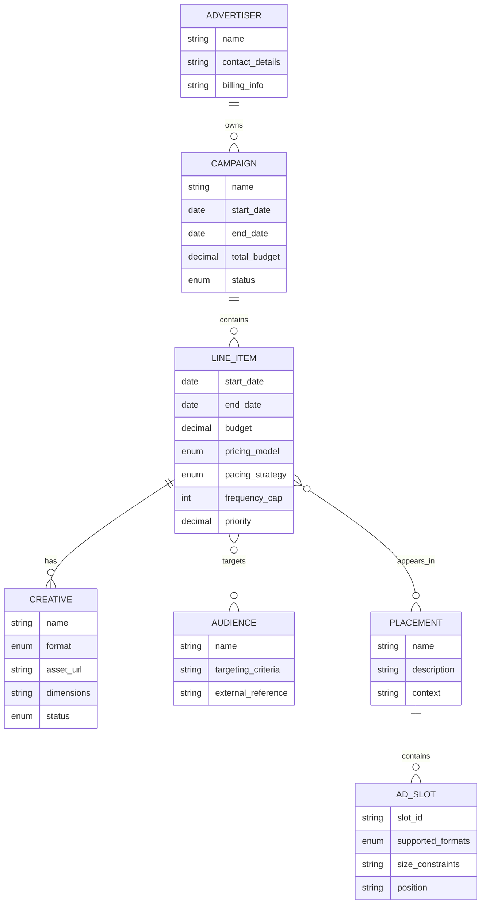

# AdTech Entity Relationship Diagram

## Entity Attributes

### Advertiser
- Name (unique)
- Contact details
- Billing information

### Campaign
- Name (unique per advertiser)
- Advertiser (foreign key)
- Flight dates (start/end)
- Total budget
- Status (draft/active/paused/archived)

### Line Item
- Campaign (foreign key)
- Start date (required)
- End date (optional)
- Budget (≥1)
- Pricing model (CPM/CPC/Fixed)
- Pacing strategy (ASAP/Even distribution)
- Frequency cap (0-30 per user)
- Priority/bidding weight

### Creative
- Line Item (foreign key)
- Name (unique within line item)
- Format (banner/video/native)
- Asset reference (URL or storage location)
- Dimensions (for banners)
- Status (draft/approved/active)

### Audience/Segment
- Name
- Targeting criteria/predicate
- External reference (if from CDP like Lytics)

### Placement
- Name (unique)
- Description
- Context (where in app)

### Ad Slot
- Placement (foreign key)
- Slot ID (unique)
- Supported formats (banner/video/native)
- Size constraints
- Position

## Notes

- Line Item → Audience/Segment: Many-to-many (line item can target multiple audiences)
- Line Item → Placement: Many-to-many (line item can target multiple placements)
- Creative format must match Ad Slot supported formats for serving
- Status/lifecycle applies at Campaign and Creative levels
