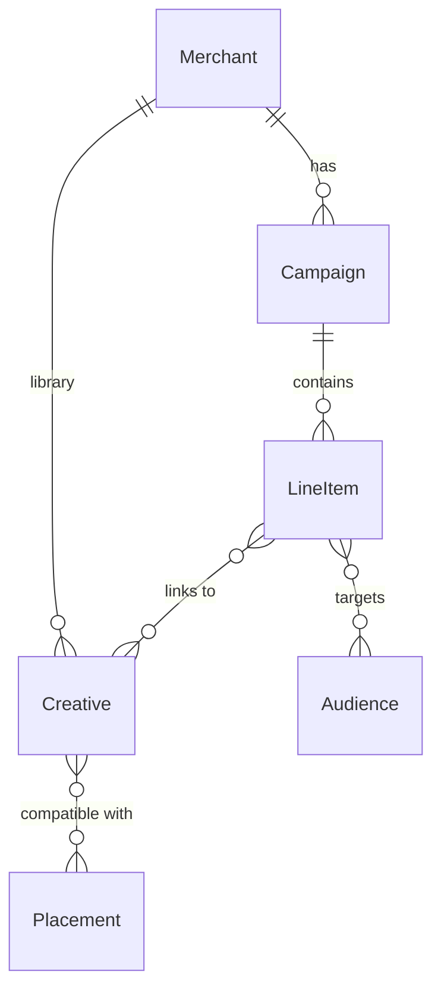

# CMP: Campaign Data Model (Draft)

Working draft of the entity-relationship model for the Commerce Media Platform. This captures the shape agreed so far, with open questions noted.

## Entities

### Merchant
CMP-local representation of an advertiser. Stores the retailer-service canonical ID as a soft reference (no foreign-key constraint). The CMP does not depend on retailer-service at runtime; integration is in the management layer only.

### Campaign
One advertising effort for a merchant. Carries dates and status. Belongs to exactly one merchant.

### Line Item
The atomic unit of delivery within a campaign. Carries flight dates, status, and targeting (audience selection). Belongs to exactly one campaign.

### Creative
An ad asset (image or video) held in the merchant's library. Carries CDN URL, format, and dimensions. Belongs to exactly one merchant and can be reused across that merchant's line items.

### Audience
A segment definition describing a group of shoppers by attribute rules. Referenced by line items as an inclusive targeting condition.

### Placement
An advertising surface in the app. Carries accepted formats, dimensions, and slot count. Registered through engineering, not created in the booking tool.

## Relationships

- **Merchant → Campaign**: one to many
- **Merchant → Creative**: one to many (the creative library)
- **Campaign → Line Item**: one to many
- **Line Item ↔ Creative**: many to many, scoped by convention to the same merchant (enforced in management layer, not schema)
- **Line Item ↔ Audience**: many to many, AND-combined for targeting
- **Creative ↔ Placement**: many to many, pre-computed on creative save or placement spec change (see below)

## Design decisions

**Merchant decoupling.** The CMP owns its own merchant entity. The retailer-service canonical ID is stored for integration but with no integrity constraint and no runtime dependency. This supports the broader directive to keep subsystems decoupled and reusable.

**Creative–placement compatibility.** Pre-computed and stored as a direct relationship between creative and placement — not mediated through the line item. Recomputed when a creative is saved or a placement spec changes. This gives the ad server a pre-computed answer at decision time without deriving compatibility on every request.

**Line item–creative scoping.** A line item can only link to creatives belonging to the same merchant. This is enforced in the management layer, not by schema constraint.

## Open questions

| Question | Context |
|----------|---------|
| **Does a line item explicitly target placements?** | Sometimes an ad should just fill whichever placement the ad server is serving. If line items don't always nominate placements, the compatibility relationship between creative and placement becomes the primary determinant of where an ad can appear. |
| **If placement targeting is optional, what is the default?** | Is a line item eligible everywhere it has a compatible creative (everything-everywhere, with placement targeting as an optional restriction)? Or must it always opt in to specific placements? This is a product question. |
| **Merchant representation details** | What fields beyond name, ECJ destination, and retailer-service ID are needed? How is a non-merchant account (for non-ECJ campaigns) represented? |
