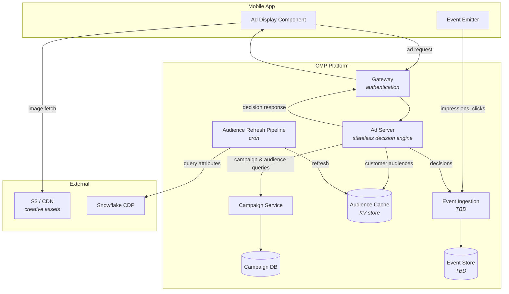

# CMP: Steel Thread

## Intent

This document describes a steel-thread build plan for the Commerce Media Platform (CMP). A steel thread is a thin, end-to-end path through the full system — minimal scope at each layer, but touching every layer. The goal is to prove the architecture works and to surface integration risks early, before committing to full-depth implementation in any single domain.

The steel thread is not the MVP. It is the first pass that validates the technical approach, after which each domain can be deepened toward MVP capability with confidence that the pieces connect.

## Scope

This document covers **functional requirements only**. Non-functional concerns are expected to be addressed as part of normal service development and are not specified here.  In particluar logging is referenced in the project brief but is excluded from this document for being a normal part of observability which should be considered for any new service.

The following are **deliberately excluded from the steel thread** and will be addressed as each domain is deepened toward MVP:

| Exclusion | Rationale |
|-----------|-----------|
| Frequency capping | Requires impression-count state; adds complexity to the decision path without proving the architecture |
| Campaign management UI | A CLI is sufficient to prove the management domain; the booking tool is a depth concern |
| Delivery treatments (guaranteed-first, rotation tenancy) | Steel thread selects at random from eligible campaigns; priority and rotation logic is additive |
| Holdouts / incrementality | Requires stable assignment, ghost opportunities, and control-group logic — depth, not breadth |
| House-ad fallback | The steel thread serves what's available; structured fallback tiers are additive |
| Contextual targeting | Audience targeting proves the selection path; adding context conditions is additive |
| Creative A/B | Proving delivery of one creative per line item is sufficient; rotation between variants is depth |
| Multi-slot placements | Steel thread targets a single-slot placement; carousel/story fills are additive |
| Video creatives | Static images prove the delivery path; video adds app-side complexity without architectural value |
| Contentstack migration | The steel thread runs alongside the existing path; migration is an operational concern |
| Monetary logic (CPM/CPC/CPA) | Explicitly post-MVP; not relevant to proving the platform works |

## Functional domains

The CMP is decomposed into five functional domains:

| Domain | Responsibility |
|--------|---------------|
| **Content Delivery** | Getting ad content to the app: asset storage, CDN, gateway, API response format, app-side rendering |
| **Ad Selection** | Real-time decisioning: eligibility, targeting, priority, rotation |
| **Campaign Management** | System of record: campaign hierarchy, creative library, audience definitions, configuration |
| **Reporting** | Event capture, ingestion pipeline, performance views, incrementality analysis |
| **Inventory** | Placement registry: what advertising surfaces exist, their format, dimensions, and slot configuration |

## Architecture

**Design note: ad server with no database.** No current feature requires the ad server to own persistent state. It reads campaign definitions from the campaign service, audience memberships from the audience cache, and returns a decision. Keeping it this way confers benefits: it scales horizontally without coordination, has no migration or data integrity concerns, and its failure mode is clean. If a future feature (e.g. frequency capping) requires fast stateful reads, the expectation is a separate purpose-built component rather than adding a database to the ad server.

**Request flow:**
1. App requests an ad via the gateway (authenticated).
2. Gateway forwards to the ad server.
3. Ad server queries the campaign service for eligible campaigns and the audience cache for the customer's memberships.
4. Ad server makes a selection decision; returns a JSON payload (CDN URL, enrichment metadata, tracking references).
5. App renders the creative, fetching the image directly from the CDN.
6. App emits impression/click events to the ingestion layer (design TBD).

## Phases

Each phase delivers minimal capability in one domain, building on what came before. Together, the five phases prove the full end-to-end path.

### Phase 1: Content Delivery

**Delivers:** An ad appearing in the app, served by our own infrastructure.

- A small number of compatible ad images stored in an S3 bucket.
- A new **ad server service** that serves them through a simple API, selecting at random.
- A new **gateway service** providing authentication for the app-to-ad-server path.
- **Mobile app changes**: a new React component to display the ad.
- The ad server returns a JSON response containing a CDN URL plus enrichment metadata (e.g. overlay text).

**Introduces:** Ad server service, gateway service, app ad-display component.

### Phase 2: Ad Selection

**Delivers:** Ads selected based on campaign relevance and audience membership, rather than at random.

- A new **campaign service** with its own database, serving campaign and audience definitions.
- A separate, fast **audience cache** (key-value store): customer ID to audience memberships, enabling per-request lookup.  **Redis**?
- Campaign line items reference content in the existing S3 bucket.
- The ad server is enhanced to query the campaign service and audience cache, selecting from relevant campaigns' creatives rather than at random.
- The ad server remains stateless; it acts as the decision engine, reading state from external stores.
- Campaigns and audiences are configured directly (seeded data) — no management interface yet.

**Introduces:** Campaign service, campaign database, audience cache.

**Deliberately excluded:** Frequency capping. Requires impression-count state and is out of scope for the steel thread.

### Phase 3: Campaign Management

**Delivers:** The ability to manage campaigns and audiences without direct database access.

- The campaign service API is extended with **management endpoints** (CRUD for campaigns, line items, creatives, audiences).
- A **pipeline** (or equivalent mechanism) refreshes the audience cache periodically, querying the Snowflake CDP for customer attributes and matching against audience definitions. A cron-based refresh is sufficient; real-time reaction to audience definition changes is not required.
- **Authentication** for management access.
- A **CLI** to call the management API. This is not the intended end-user experience, but is sufficient for the steel thread — it enables managing campaigns during testing and experimentation.

**Introduces:** Management API, audience refresh pipeline, CLI.

### Phase 4: Reporting

**Delivers:** Capture and storage of ad events, enabling performance analysis.

- Event capture for **decisions, impressions, and clicks**.
- Events sourced from **both back end and front end**, with correlation between the two (e.g. a front-end impression event linked to the back-end decision that produced it).
- Events stored in a queryable form.

**Status:** Solution design is outstanding. The event schema, ingestion mechanism, storage destination, and correlation approach are yet to be determined.

### Phase 5: Inventory

**Delivers:** A registry of advertising surfaces available in the app.

**Status:** Not yet discussed. No solution proposed.

## Gaps and next steps

| Gap | Action |
|-----|--------|
| Reporting solution design | Determine event schema, ingestion mechanism (pipeline vs direct write), storage destination, and front-end/back-end event correlation |
| Inventory design | Determine how placements are registered, what metadata they carry, and how Selection and Campaign Management reference them |
| Entity-relationship model | Campaign service data model to be decided (phase 2) |
| Audience source | Confirm the authoritative Snowflake CDP source and practical sync cadence (phase 3) |
