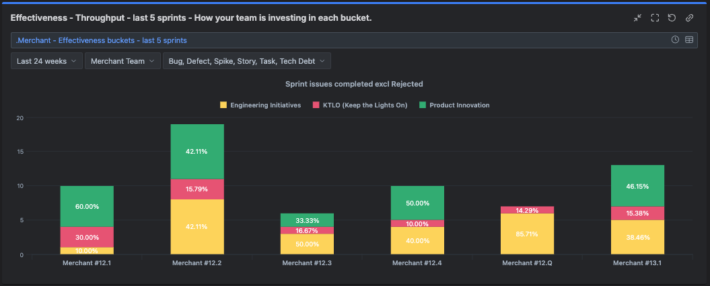
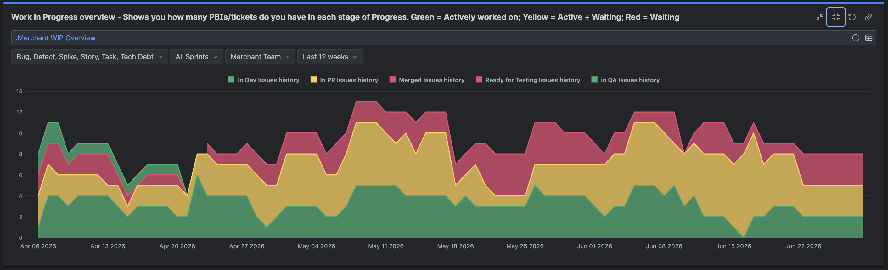
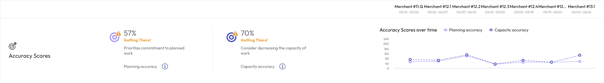
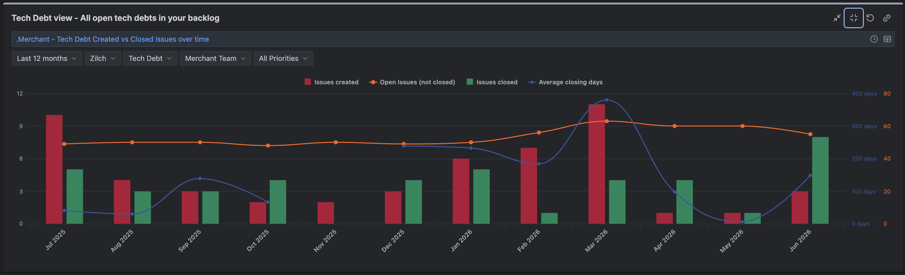
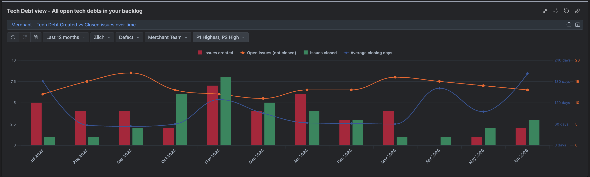

# Merchant Team — KPI Review (Iteration 12)

## Effectiveness — Investment Mix

**Target:** 70% Product / 30% Engineering

**Source:** Jira KPI dashboard

**Is this where we intended to be?**

No. The mix is volatile sprint-to-sprint and we're not consistently hitting the 70% product target. Product work is always prioritised first, with remaining capacity filled by engineering initiatives. The issue isn't prioritisation — it's the amount of product work ready to plan into each sprint.

For 13.1 specifically, the team has switched product managers, moved onto a new roadmap, and the backlog isn't yet well-prepared. Kieran and I are actively fleshing out upcoming work, so this should improve as the iteration progresses. For earlier i12 sprints, the pattern is less clear-cut and I don't have a single root cause.

**Anything we can improve?**

Continue building up a well-refined product backlog so that sprint planning doesn't default to engineering fill. Expect to see this stabilise as the new roadmap matures.

## Efficiency — Flow & Predictability

**Source:** Jira KPI Dashboard

**Target:** Cycle time < 5 days

**Is this where we intended to be?**

WIP levels are stable but there's visible accumulation at the code review stage. Tickets are getting nearly completed in a sprint but sitting in review long enough to carry over into the next. This is the key issue driving several other metrics.

A contributing factor is team size — with only 2 BE and 2 FE at present, the pool of available reviewers is small. This is a mitigation, not a full explanation, and I need to dig deeper into specific cases.

**Anything we can improve?**

I'm introducing engineering metrics as a standing item in sprint retro. Each retro we'll examine the ticket with the longest wait time and investigate what caused the delay. This should surface patterns and create accountability for review turnaround. Additionally, the team is growing — upcoming hires will expand the reviewer pool.

## Planning & Capacity

**Source:** LinearB

**Target:** 70% planning accuracy

**Is this where we intended to be?**

Planning accuracy shows 57%, below the 70% target. However, I believe this overstates the problem. The metric is being distorted by how rolled-over tickets are accounted for: when a ticket carries over, its full story point value is counted in the new sprint even if only residual effort remains. I accommodate this in planning by only bringing in stories to fill remaining capacity, but on paper it appears as if the sprint is overloaded.

Example: an 8-point story rolls with 1 point of residual work. I bring in 7 new points to make 8 total real effort, but the tool reports 15 points planned. If I deliver 8, it looks like I only hit ~53% accuracy.

The root cause is the same flow issue described above — tickets stalling in review and carrying over. Fixing review turnaround will directly improve this metric.

Capacity accuracy at 70% is on target and more reflective of actual planning quality.

**Anything we can improve?**

Address the review bottleneck (see Efficiency above). As carryover reduces, planning accuracy will align more closely with reality.

## Defects / Tech Debt

**Source:** Jira KPI dashboard

**Target:** Resolve priority defects within SLA

**Is this where we intended to be?**

Not yet, but both charts show recent improvements. The open tech debt backlog rose around March 2026 and has remained elevated, with average closing days climbing. P1/P2 defects show a longer-term downward trend in open issues, though closing time has been volatile.

To date, tech debt and defect resolution has been opportunistic — picked up when capacity allows. This isn't driving the numbers down systematically.

**Anything we can improve?**

Starting from iteration 13, I'm introducing per-iteration epics for both tech debt and defect resolution. This gives us a planned, trackable approach to driving the backlog down rather than relying on ad-hoc pickup. The iteration 13 tech debt epic is currently being populated.
